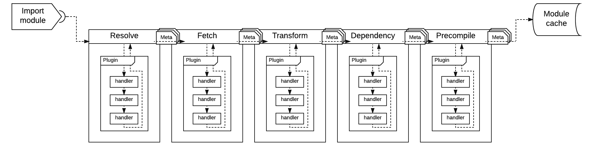

</img>

[](https://travis-ci.org/MiguelCastillo/bit-loader) [](https://gitter.im/MiguelCastillo/bit-loader?utm_source=badge&utm_medium=badge&utm_campaign=pr-badge&utm_content=badge)


<!-- START doctoc generated TOC please keep comment here to allow auto update -->
<!-- DON'T EDIT THIS SECTION, INSTEAD RE-RUN doctoc TO UPDATE -->
**Table of Contents**

- [Introduction](#introduction)
- [Examples](#examples)
- [Install npm dependencies, build, and test](#install-npm-dependencies-build-and-test)
- [Architecture Overview](#architecture-overview)
  - [The first stage - the module loading stage](#the-first-stage---the-module-loading-stage)
    - [5 pipelines](#5-pipelines)
  - [The second stage - the module building stage](#the-second-stage---the-module-building-stage)
- [Plugins](#plugins)
- [Default providers](#default-providers)
    - [Example](#example)
- [Module Meta](#module-meta)
    - [Pipeline Flow of the first and second stage](#pipeline-flow-of-the-first-and-second-stage)
    - [Visual of fetch pipelines](#visual-of-fetch-pipelines)
- [Pattern Matching](#pattern-matching)
  - [match](#match)
  - [ignore](#ignore)
  - [extensions](#extensions)
- [License](#license)

<!-- END doctoc generated TOC please keep comment here to allow auto update -->


## Introduction

> Framework for building module loaders. This is the core library for [bit-imports](https://github.com/MiguelCastillo/bit-imports) and [bit-bundler](https://github.com/MiguelCastillo/bit-bundler).


## Examples

Please checkout the [examples](https://github.com/MiguelCastillo/bit-loader/tree/master/example).  There you will find different recipes for setting things up.


## Install npm dependencies, build, and test

```
$ npm install
$ grunt build
$ grunt test
```

All build artifacts will be in the `dist` folder.


## Architecture Overview

`bit-loader` is composed of a two stage system. The first stage is responsible for loading and processing files via puggable pipelines. And a second stage is responsible for building (compiling and linking) modules.

### The first stage - the module loading stage

This stage is responsible for loading files from storage and processing them in order to generate a graph, which we refer to as module graph. The module graph is basically a tree structure that outlines the dependency hierarchy of the modules.

This stage is composed of several pluggable pipelines that cascade *information* from one pipeline to the next. This *information* is encapsulated in an object we refer to as *module meta*. More information on the module meta objects can be found [here](#module-meta). The flow that module meta objects go through is described below:

First, we need to convert module names to file paths in order to load modules from storage. This conversion is called *module name resolution*, which is done in the `resolve` pipeline. The `path` generated in the `resolve` pipeline is then used by the `fetch` pipeline to load module files from storage. These files are subsequently processed by the `transform` pipeline, which is generally where all transpilation/transformation is done. The result of the `transform` pipeline is pushed through the `dependency` pipeline, which pulls out dependencies and recursively feeds them through the first stage (module loading stage) until no more modules are left to load into the module graph. And finally, a helper pipeline called `precompile` that allows you to preemptively set the module `exports`, which effectively prevents modules from being processed in the build stage.

> This stage is entirely asynchronous, and the output is a module graph.


#### 5 pipelines

The module loading stage has 5 pipelines, which are described below.

- **`resolve`** - responsible for generating paths to read module files from storage.
- **`fetch`** - responsible for loading files from storage.
- **`transform`** - responsible for processing and transforming loaded files.  E.g. ES2015 to ES5 via babeljs. Or CoffeeScript to JavaScript.
- **`dependency`** - responsible for parsing out dependencies from the loaded files and recursively feeding them to the module loading stage.
- **`precompile`** - provides you with a hook for preemptively building modules in the fetch stage, which effectively prevents module processing in the build stage.

These five pipelines are pluggable, which means that you can register handler functions (plugins) to process module data in each one of them. These pipelines are executed sequentially in the order listed above with each pipeline cascading data from one to the next. Furthermore, all these pipelines use Promises to orchestrate any asynchronous processing done by each configured handler.

Each one of these pipelines (with the exception of precompile) has a corresponding pre and post companion. That means that `resolve` really also provides you with `preresolve` and `postresolve`. The purpose for the pre and post handlers is to provide hooks to configure modules data to be used by the actual pipeline.

More details on how to hook into these pipelines can be found in the [plugins](#plugins) section.


### The second stage - the module building stage

The build stage (compile + linking) is where the *transformed files* are converted to *evaluated code*, which is what host applications generally consume.

> The build stage is synchronous and it is *not* pluggable.

The combination of the first (*asynchronous*) stage with the second (*synchronous*) build stage enables support for `CJS`,`AMD`, and `ES6 modules` simultaneously.


---


## Plugins

A plugin is a container with handler functions that hook into the loader's pipelines in order to customize loading and processing of modules.

> A handler is fundamentally a `transform` or `reducer` function as found in many other systems. However, it is called `handler` in `bit-loader` to prevent confusion with the `transform` pipeline.

Handler arguments and return values are:

- *param* { object } **`meta`** - Object with information to be processed. See [module meta](#module-meta).
- *param* { Handler } **`handler`** - Handler instance object, which provides a couple of helper methods such as `getLogger`.
- *param* { function } **`cancel`** - Function to cancel the execution of all plugin handlers for the particular pipeline the handler is executing on.
- *returns* { object | Promise } Object with properties to be merged into the module meta object. Plugin handlers can alternatively return promises to control asynchronous workflows.

The example below is a plugin with a handler that hooks into the fetch pipeline to load modules from storage, and another handler that hooks into the transform pipeline to add `'use strict;'` to loaded modules.

``` javascript
// Plugin handler to load file from storage using the fetch API.
function loadFile(meta, options, cancel) {
  return window
    .fetch(meta.path)
    .then(function(response) {
      return {
        source: response.text();
      };
    });
}

// Plugin handler to add `use strict` to loaded modules
function addStrict(meta, options, cancel) {
  return {
    source: "'use strict;'\n" + meta.source
  };
}

// Configure plugin with the two handlers
bitloader.plugin({
  fetch: loadFile,
  transform: addStrict
});
```

Plugins can take a single or an array of handlers, and a handler can be a module name (a string). When a handler is a module name, `bit-loader` will dynamically load it at runtime. The following example shows the handlers passed in as an array and one of the handlers is a module name.

``` javascript
bitloader.plugin({
  fetch: [ loadFile ],
  transform: [ "add-strict" ]
});
```

When a handler is an object, a property `handler` is expected to be defined as either a module name or a function. Some of the reasons to define a plugin handler as an object is to specify options to be passed onto the `handler` function when it is executed and/or to configure pattern matching. See [pattern matching](#pattern-matching).

The example below configures a plugin handler as an object. Notice the `handler` is "add-strict" which is the name of the module to be dynamically loaded at runtime. The options for the handler is also forwarded to the `handler` function when it is invoked.

``` javascript
bitloader.plugin({
  fetch: loadFile,
  transform: {
    handler: "add-strict",
    options: {
      inlineMap: true
    }
  }
});
```

A plugin can alternatively define a function as a handler.

``` javascript
bitloader.plugin({
  fetch: loadFile,
  transform: {
    handler: function(meta, handlerInstance, cancel) {
      return {
        source: "'use strict;'\n" + meta.source
      };
    },
    options: {
      inlineMap: true
    }
  }
});
```

Plugins also provide a way to define the shape of the modules your plugins can process via pattern matching. For example, you can specify properties like the module path, module name, or even match content in the module source. Below is an example configuring a plugin to only process files with `js` and `es6` extensions:

``` javascript
bitloader.plugin({
  extensions: ["js", "es6"]
});
```

We did all the previous steps separately for illustration purposes, but we can certainly do all that stuff in a single call.

``` javascript
var bitloader = new Bitloader();

bitloader.plugin({
  extensions: ["js", "es6"],
  fetch: loadFile,
  transform: addStrict
});
```

Or alternatively, via `bit-loader`'s constructor

``` javascript
var bitloader = new Bitloader({
  plugins: [{
    extensions: ["js", "es6"],
    fetch: loadFile,
    transform: addStrict
  }]
});
```

Plugin registration can also take a function, which is called with a plugin builder that helps merge plugin configurations.  This is really useful if you are looking to author plugins and you need to merge in options from the users.

``` javascript
var bitloader = new Bitloader();

bitloader.plugin(function(builder) {
  return builder.configure({
    extensions: ["js", "es6"],
    fetch: loadFile,
    transform: addStrict
  });
});
```

> Take a look a this [plugin](https://github.com/MiguelCastillo/bit-loader-js/blob/master/index.js) for a sample implementation using the plugin builder.


## Default providers

All pluggable pipelines have an optional default provider, which is just a default handler that is executed when no plugin can process a particular module. These are configured by providing the corresponding handlers in `bit-loader`'s constructor.

> [bit imports](https://github.com/MiguelCastillo/bit-imports) and [bit-bundler](https://github.com/MiguelCastillo/bit-bundler) both implement default providers to give base functionality without configuring plugins.

#### Example
``` javascript
function resolvePath(meta) {
  return {
    path: "path/to/module/" + meta.name
  };
}

function loadFile(meta) {
  return window
    .fetch(meta.path)
    .then(function(response) {
      return {
        source: response.text();
      };
    });
}

// The compilation is not pluggable. However, you can always set `exports` in
// any stage to tell bit-loader that the module is ready for consumption.
function compileModule(meta) {
  return {
    exports: eval(meta.source)
  };
}


//
// Instantiate bitloader with default providers.
//
var bitloader = new Bitloader({
  resolve    : resolvePath,
  fetch      : loadFile,
  precompile : compileModule
});
```

## Module Meta

So what exactly are the different pipelines passing around anyways? They are passing around a module meta object, which is an object that contains the current state of the module. This object is an intermediate representation that the build stage uses to create module instances that the host application ultimately consumes.

> Modifying module meta objects is the primary responsibility of the different pipelines.

The basic shape looks like this, but plugin handlers are free to add more data to it.

- **`deps`** { Array[ string ] } - Collection of module names a particular module depends on. Used by the `dependency` stage.
- **`name`** { string } - Name of the module to load. Used by `resolve` to figure out the `path`.
- **`path`** { string } - Path for the module file. Used by `fetch` to load the module file.
- **`source`** { string } - File content of the module.  Use by `transform` to transpile the module content.
- **`referrer`** { { string: path, string: name } } - Information about the module requesting to load the current module.

#### Pipeline Flow of the first and second stage

* first stage (fetch stage) *async*
  * create moduleMeta
  * resolve (moduleMeta)
    * calculate module path from moduleMeta.name and set moduleMeta.path
  * fetch (moduleMeta)
    * read module file using moduleMeta.path and set moduleMeta.source
  * transform (moduleMeta)
    * run custom transforms and set moduleMeta.source
  * dependency (moduleMeta)
    * parse out dependencies from moduleMeta.source and set moduleMeta.deps
    * recursively feed each item in moduleMeta.deps through the first stage
  * precompile (moduleMeta)
    * optionally builds and sets moduleMeta.exports, which prevents the build stage from processing the particular module

* second stage (build stage) *sync*
  * compile - evalutes moduleMeta.source
  * link - calls factory, creates module instance, and sets module.exports


#### Visual of fetch pipelines

</img>


## Pattern Matching

Pattern matching rules allow you to define which modules are processed by `bit-loader`. This is accomplished by defining `match`, `ignore`, and `extensions` rules, which can be defined in plugins and in plugin handlers. You can also specify `ignore` rules in `bit-loader` instances. This combination gives you lots of control over what parts of your setup can process particular modules.

- `match` and `ignore` rules are objects whose properties are matched against properties in module meta objects. For example, if you have a `match` rule object with a property called `path`, then the `path` in module meta will be tested to determine if the particular module meta can be processed.

- `extensions` rules is a strings or array of strings to match the file extension of the module being loaded.

> `bit-loader` pattern matching rules are an abstraction on top of [roolio](https://github.com/MiguelCastillo/roolio), so feel free to explore different matching rules, including custom ones. But generally, you will only specify strings and regexp.

### match

> match rules define which modules are *processed* by bit-loader.

The following example sets a `match` rule in a plugin to only process modules that have `src/views` in the path.  All other modules are ignored by this plugin.

``` javascript
var Bitloader = require("bit-loader");
var bitloader = new Bitloader();

bitloader.plugin({
  match {
    path: /src\/views/
  },
  transform: [
    function(meta) {
      console.log(meta.name);
    }
  ]
});
```

Expanding on the previous example, we set a `match` rule for a particular plugin handler so that it only processes modules with names that end in `region`. This basically tells the plugin that it can only process modules in `src/views` and that the particular transform can only process modules with names that end in `region`.

``` javascript
var Bitloader = require("bit-loader");
var bitloader = new Bitloader();

bitloader.plugin({
  match {
    path: /src\/views/
  },
  transform: [
    {
      match: {
        name: /region$/
      },
      handler: function(meta) {
        console.log(meta.name);
      }
    }
  ]
});
```

### ignore

> ignore rules define which modules are *ignored* by bit-loader.

`ignore` rules are defined exactly the same way as `match` rules. You configure `ignore` rules if you want particular plugins and plugin handlers as well as `bit-loader` instances to ignore certain modules.

The following example tells `bit-loader` to ignore modules with the name `react` and `jquery`.

``` javascript
var Bitbundler = require("bit-bundler");
var bitbundler = new Bitbundler({
  ignore: {
    name: ["react", "jquery"]
  }
});
```

> You can alternatively use the short form `ignore: ["react", "jquery"]` when configuring ignore rules for bit-loader instances.

By default, ignore rules in bit-loader instances will prevent the `transform` and `dependency` pipelines from processing modules. You can further customize which pipelines ignore which modules by specifying a `services` array with the names of the pipelines that ought to skip module processing. The valid pipelines are `resolve`, `fetch`, `transform`, `dependency`, and `precompile`.

The following example illustrates how to configure a plugin so that it ignores all modules in `src/views`

``` javascript
var Bitloader = require("bit-loader");
var bitloader = new Bitloader();

bitloader.plugin({
  ignore {
    path: /src\/views/
  },
  transform: [
    function(meta) {
      console.log(meta.name);
    }
  ]
});
```

### extensions

> extensions rules defines which modules with particular file extensions can be processed by *bit-loader*

`extensions` rules are a shortcut for defining pattern matching rules for module meta paths with regular expressions to test for file extensions.  E.g. `match: { path: /\.(js|jsx)$/gmi }`.  But extension matching is such a common use case that making this simpler is very convenient.

> `extensions` rules are case insensitive.

``` javascript
var Bitloader = require("bit-loader");
var bitloader = new Bitloader();

bitloader.plugin({
  extensions: ["js", "jsx"],
  transform: [
    function(meta) {
      console.log(meta.path);
    }
  ]
});
```


## License

Licensed under MIT

<!--
## Reference diagrams

### Loader diagram
</img>

### Fetch diagram
</img>

### Pipeline diagram
</img>
-->
