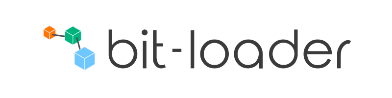

</img>

[](https://travis-ci.org/MiguelCastillo/bit-loader) [](https://gitter.im/MiguelCastillo/bit-loader?utm_source=badge&utm_medium=badge&utm_campaign=pr-badge&utm_content=badge)


## Introduction

> Framework for building module loaders. This is the core library for [bit-imports](https://github.com/MiguelCastillo/bit-imports) and [bit-bundler](https://github.com/MiguelCastillo/bit-bundler).


## Examples

Please checkout the [examples](./example).  There you will find different recipes for settings things up.


## Install npm dependencies, build, and test

```
$ npm install
$ grunt build
$ grunt test
```

All build artifacts will be in the `dist` folder.


## Architecture Overview

bit loader is composed of a two stage system. The first stage is responsible for loading and processing files via puggable pipelines. And a second stage is for building (compiling and linking) modules.

#### The first stage - the module loading stage

First, we need to convert module names to file paths in order to load modules from storage. The module name resolution is done in the `resolve` pipeline and files are loaded from storage in the `fetch` pipeline. The contents loaded from storage are then processed in the `transform` pipeline, which is where all transpilation/transformation is done. The result of the `transform` pipeline is passed on to the `dependency` pipeline, which pulls out dependencies and recursively pushes them through the loading workflow until no more modules are left to load in the module graph.

> This stage is entirely asynchronous.

This stage has 4 pipeline:

- **resolve** - responsible for generating paths to read module files from storage.
- **fetch** - responsible for loading files from storage.
- **transform** - responsible for processing and transforming loaded files.  E.g. ES6 to ES5 via babeljs. Or CoffeeScript to JavaScript.
- **dependency** - responsible for parsing out dependencies from the loaded files.

These four pipelines are pluggable, which means that you can register handler functions to process module data in each one of them. These pipelines are executed sequentially in the order listed above, with each pipeline cascading data from one to the next.

More details on how to hook into the pipelines can be found in the [plugins](#plugins) section. More details on each pipeline can be found [here](#pipelines).

#### The second stage - the module building stage

The build stage (compile + linking) is where the *transformed files* are converted to *evaluated code*, which is what host applications generally consume.

> The build stage is synchronous.

The combination of the first (*asynchronous*) stage with the second (*synchronous*) build stage enables support for `CJS`,`AMD`, and `ES6 modules` simultaneously.


## Pipelines

> Each pipeline has a very speific reponsibility.

#### Resolve

First, we need to be able to convert module names (ids) to paths we can use to read module files from storage. The paths generated by this pipeline will be consumed by the fetch pipeline. Resolve is generally aware of the environment in which it executes in order to handle environemtn specific pathing; e.gg Windows vs MacOS file paths.

#### Fetch

Once we have a proper file path for the module, we read it from storage. Storage can be local file system, a remote server via XHR, a websocket, or anything that can give us text content. Your fetch provider or plugin defines that behavior.

#### Transform

Once module files are fetched (read from storage), we generally process their content in some way or another.

For example, reading a Markdown file from storage is just text but to really make use of it when rendering to screen, you generally convert it to HTML. Or maybe you have JavaScript code written in ES2015 (or later) and want to transform it to good ole ES5 so that older browsers can run your code. You can setup a [babel](https://babeljs.io/) transform to handle this. And that's exactly what the transform pipeline is for -- for processing module files that is eventually used by the host application.

Once all configured transforms get a chance to execute, the transform pipeline feeds the processed module files to the next pipeline called dependency.

#### Dependency

An important part of the lifecycle of a module is loading dependencies on other modules. And this is where we get a chance to tell `bit-loader` just that. For example, we can parse `require` statements in JavaScript files so that `bit-loader` can load and process those up automatically for us.

The most important part of this particular pipeline is that all dependencies generated here will get recursively loaded before the current module is further processed. And by the time this pipeline is finished, modules have their entire dependency graph fully loaded.


---


## Plugins

Plugins are the primary vehicle for registering handler functions into the different pipelines to load and process module files. Below is a sample plugin called `css` that registers a handler method for fetching module files from storage:

``` javascript
var bitloader = new Bitloader();

bitloader.plugin("css", {
  fetch: fetchCss
});

function fetchCss(meta) {
  return get(meta.path);
}
```

> Plugin handlers can return promises to control asynchronous work.

You can also register handler functions for transforming module files. Building on the `css` plugin example, we can register two handler functions in the transformation pipeline as follows:

``` javascript
var bitloader = new Bitloader();

bitloader.plugin("css", {
  transform: [cssTransform1, cssTransform2]
});
```

Plugins also provide a way to specify the shape of the modules your plugins can process. For example, you can specify properties like the module path, module name, or even match content in the module source. This is all done via matching rules. Below is an example configuring the `css` plugin to only process files with `.css` and `.less` extensions:

``` javascript
var bitloader = new Bitloader();

bitloader.plugin("css", {
  match: {
    path: /\.(css|less)$/
  }
});
```


We did all the previous steps separately for illustration purposes, but we can certainly do all that stuff in a single call.

``` javascript
var bitloader = new Bitloader();

bitloader.plugin("css", {
  match: {
    path: /\.(css|less)$/
  },
  fetch: fetchCss,
  transform: [cssTransform1, cssTransform2]
});
```


## Default providers

All pluggable pipelines have a default provider, which is just a default handler that executes when plugins can't process a particular module. These are configured by providing the corresponding handlers in `bit-loader`'s constructor.

> [bit imports](https://github.com/MiguelCastillo/bit-imports) and [bit-bundler](https://github.com/MiguelCastillo/bit-bundler) both implement defaul providers to give base functionality without requiring plugins.

#### Example
``` javascript
function resolvePath(meta) {
  return {
    path: "path/to/module/" + meta.name
  };
}

function loadFile(meta) {
  return get(meta.path).then(function(text) {
    return {
      source: text
    };
  });
}

// The compilation is not pluggable. However, you can always set `exports` in
// any stage to tell bit-loader that the module is ready for consumption.
function compileModule(meta) {
  return {
    exports: eval(meta.source)
  };
}


//
// Instantiate bitloader with default providers.
//
var bitloader = new Bitloader({
  resolve   : resolvePath,
  fetch     : loadFile,
  transform : compileModule
});
```

## Module Meta

So what exactly are the different pipelines passing around, anyways? They are passing around a module meta object, which is an object that contains the current state of the module. This object is an intermediate representation that the build stage uses to create module instances that the host application ultimately consumes.

> Modifying module meta objects is the primary responsibility of the different pipelines.

- **`name`** { string } - Name of the module to load. Used by `resolve` to figure out the `path`.
- **`path`** { string } - Path for the module file. Used by `fetch` to load the module file.
- **`source`** { string } - File content of the module.  Use by `transform` to transpile the module content.
- **`deps`** { Array[ string ] } - Collection of module names and paths a module depends on. Used by the `dependency` stage.
- **`referrer`** { { string: path, string: name } } - Information about the module requesting to load the current module.

#### Pipeline Flow of the first and second stage

* first stage
  * create moduleMeta
  * resolve (moduleMeta)
    * create module path from moduleMeta.name and set moduleMeta.path
  * fetch (moduleMeta)
    * read module file using moduleMeta.path and set moduleMeta.source
  * transform (moduleMeta)
    * run custom transforms and set moduleMeta.source
  * dependency (moduleMeta)
    * parse out dependencies from moduleMeta.source and set moduleMeta.deps
    * recursively feed each item in moduleMeta.deps through the first stage

* second stage
  * compile - evalutes moduleMeta.source
  * link - calls factory, creates module instance, and sets module.exports


## Matching rules

> `bit-loader` matching rules are simply an abstraction on top of [roolio](https://github.com/MiguelCastillo/roolio), so feel free to explore different matching rules, including custom ones. But generally, you will only specify strings and regex.

Matching rules allow you to define which modules are processed by `bit-loader`. This is accomplished by defining `match` and `ignore` rules. You can specify `match` and `ignore` rules in plugins and in plugin handlers. You can also specify `ignore` rules in `bit-loader` instances. This combination gives you lots of control over what part of your setup processes which modules.

`match` and `ignore` rules are objects whose properties are matched against properties in module meta objects. For example, if your `match` rule defines `path`, then the path in module meta will be tested to determine if the particular module meta can be processed.  If your `match` rule defines `source`, then the source in module meta is tested.

The following example sets a `match` rule in a plugin to only process modules that have `src/views` in the path.  Other modules are ignored by this plugin.

``` javascript
var Bitloader = require("bit-loader");
var bitloader = new Bitloader();

bitloader.plugin({
  match {
    path: /src\/views/
  },
  transform: [
    function(meta) {
      console.log(meta.name);
    }
  ]
});
```

Expanding on the previous example, we set a `match` rule for a particular plugin handler so that it only processes modules with names the end in `region`. This basically tells the plugin that it can only process modules in `src/views` and that the particular transform can only process modules with names that end in `region`.

``` javascript
var Bitloader = require("bit-loader");
var bitloader = new Bitloader();

bitloader.plugin({
  match {
    path: /src\/views/
  },
  transform: [
    {
      match: {
        name: /region$/
      },
      handler: function(meta) {
        console.log(meta.name);
      }
    }
  ]
});
```

`ignore` rules are defined exactly the same way as`match` rules. You configure `ignore` rules if you want particular plugins and plugin handlers as well as `bit-loader` instances to ignore certain modules.

The following example tells `bit-loader` to ignore modules with the name `react` and `jquery`.

``` javascript
var Bitbundler = require("bit-bundler");
var bitbundler = new Bitbundler({
  ignore: {
    name: ["react", "jquery"]
  }
});
```

> With this setup, "react" and "jquery" are not processed by the `transform` and `dependency` pipelines, which is the default behavior.

The following example illustrates how to configure a plugin so that it ignores all modules in `src/views`

``` javascript
var Bitloader = require("bit-loader");
var bitloader = new Bitloader();

bitloader.plugin({
  ignore {
    path: /src\/views/
  },
  transform: [
    function(meta) {
      console.log(meta.name);
    }
  ]
});
```


## License

Licensed under MIT

<!--
## Reference diagrams

### Loader diagram
</img>

### Fetch diagram
</img>

### Pipeline diagram
</img>
-->
